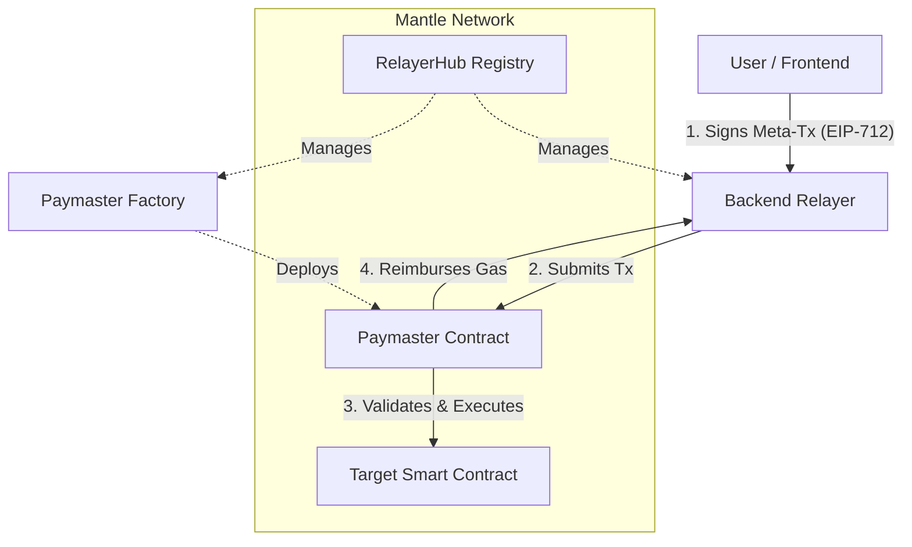

# Mantle Gas-Less Relayer

A production-grade gasless transaction system for the Mantle L2 network. This platform allows developers to sponsor user transactions, eliminating the need for end-users to hold MNT for gas fees, thereby significantly improving the onboarding experience and usability of dApps on Mantle.

##  Table of Contents

- [Overview](#-overview)
- [Architecture](#️-architecture)
- [Smart Contracts](#-smart-contracts)
- [Backend Relayer](#-backend-relayer)
- [TypeScript SDK](#-typescript-sdk)
- [Frontend Dashboard](#-frontend-dashboard)
- [Development & Quick Start](#-development--quick-start)
- [Security](#-security)
- [License](#-license)

---

##  Overview

The Mantle Gas-Less Relayer enables gasless transactions through a secure infrastructure. By utilizing EIP-712 signatures, users authorize transactions that are submitted to the blockchain by a relayer and paid for by a dedicated Paymaster contract.

**Live Demo**: [https://frontend-nine-mocha.vercel.app/](https://frontend-nine-mocha.vercel.app/)

### Key Features
- **Gasless Transactions**: Users sign messages, relayers pay the gas.
- **EIP-712 Compliant**: Secure and type-safe meta-transaction signing.
- **Flexible Paymasters**: Developers can deploy and manage their own Paymaster instances.
- **Spending Controls**: Granular limits (per-tx, daily, monthly) to manage sponsorship costs.
- **Whitelist Support**: Restrict sponsorship to specific contracts or functions.
- **Developer SDK**: Easy-to-use TypeScript SDK for frontend and backend integration.
- **Comprehensive Dashboard**: Monitor transactions, gas usage, and Paymaster health.

---

## Architecture

### System Flow



---

## Smart Contracts

The core logic resides in three main Solidity contracts:

1.  **RelayerHub**: Central registry managing approved relayers and system configuration.
2.  **PaymasterFactory**: Deploys Paymaster instances using the minimal proxy pattern (EIP-1167).
3.  **Paymaster**: Sponsors and executes meta-transactions on behalf of users.

### Deployed Contracts (Mantle Sepolia Testnet)

| Contract | Address |
| :--- | :--- |
| **RelayerHub (Proxy)** | `0xA5dd225Beb2Ec0009Fe143eb0B9309Ba07d23737` |
| **PaymasterFactory (Proxy)** | `0x4F5f7aBa739cB54BEdc6b7a6B9615DAeDc3A26A4` |
| **Paymaster Implementation** | `0xc97C6656c19fB9Dc0F9Bc384632e05d4782150C5` |

### Key Contract Functions

#### Paymaster (Individual Instances)
- `executeMetaTransaction(...)`: Core function to execute a user's signed transaction.
- `canExecuteMetaTransaction(...)`: Pre-flight validation (checks limits, whitelist, etc.).
- `deposit()` / `withdraw()`: Manage Paymaster's MNT balance.
- `addWhitelistedContract(...)`: Restrict sponsorship to specific target contracts.
- `setPerTransactionLimit(...)`: Set spending limits.

---

## Backend Relayer

The backend is a production-grade service built with Fastify that handles the submission of meta-transactions to the Mantle network.

### API Endpoints

| Method | Endpoint | Description |
| :--- | :--- | :--- |
| `POST` | `/api/v1/relay` | Submit signed meta-transaction for execution. |
| `POST` | `/api/v1/validate` | Pre-flight validation (dry run). |
| `GET` | `/api/v1/transaction/:txHash` | Get transaction status by hash. |
| `GET` | `/api/v1/paymaster/:address` | Get comprehensive Paymaster info. |
| `GET` | `/health` | Basic health check. |

### Environment Variables
Required variables for the backend:
- `MANTLE_RPC_URL`: Mantle RPC endpoint.
- `RELAYER_PRIVATE_KEY`: Relayer wallet private key.
- `RELAYER_HUB_ADDRESS`: RelayerHub contract address.
- `PAYMASTER_FACTORY_ADDRESS`: Factory contract address.
- `SUPABASE_URL` / `SUPABASE_SERVICE_KEY`: For transaction logging and analytics.

---

## TypeScript SDK

The SDK provides a type-safe, fluent API for building, signing, and submitting meta-transactions.

### Installation
```bash
npm install @mantle-relayer/sdk
```

### Quick Start
```typescript
import { MantleRelayerClient } from '@mantle-relayer/sdk';
import { Wallet } from 'ethers';

const client = MantleRelayerClient.forTestnet('https://relay.your-domain.com');
const signer = new Wallet(process.env.PRIVATE_KEY);

const signedTx = await client.buildTransaction()
  .setPaymaster('0x...')
  .setTarget('0x...')
  .setCallData('0x...')
  .setGasLimit(100000n)
  .sign(signer);

const result = await client.relay(paymasterAddress, signedTx);
console.log('TX Hash:', result.txHash);
```

---

## Frontend Dashboard

A Next.js-based dashboard for developers to manage their Paymasters, monitor gas usage, and configure whitelists.

### Features
- **Paymaster Management**: Deploy and fund new Paymasters.
- **Analytics**: Track transaction volume and gas expenditure.
- **Configuration**: Easily update spending limits and whitelists via a user-friendly UI.

---

##  Development & Quick Start

### Prerequisites
- Node.js v18+
- Foundry (for smart contracts)
- Docker (optional)

### Setup & Installation

1.  **Clone the repository**:
    ```bash
    git clone https://github.com/Majormaxx/mantle-relayer.git
    cd mantle-relayer
    ```

2.  **Smart Contracts**:
    ```bash
    cd smart-contract
    forge install && forge build
    forge test
    ```

3.  **Backend**:
    ```bash
    cd backend
    npm install
    cp .env.example .env # Configure your environment
    npm run dev
    ```

4.  **Frontend**:
    ```bash
    cd frontend
    npm install
    npm run dev
    ```

5.  **SDK**:
    ```bash
    cd sdk
    npm install && npm run build
    ```

---

## Security

- **EIP-712 Signing**: Ensures users know exactly what they are signing.
- **Replay Protection**: Nonce-based management prevents transaction replays.
- **Spending Limits**: Protects developers from unexpected gas costs.
- **Access Control**: Whitelists ensure only authorized contracts/functions are sponsored.
- **Rate Limiting**: Backend protection against spam and DDoS.

---

## License

This project is licensed under the MIT License - see the [LICENSE](LICENSE) file for details.
